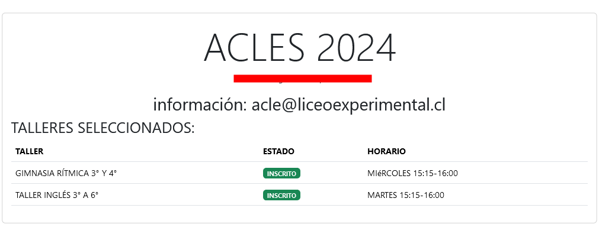
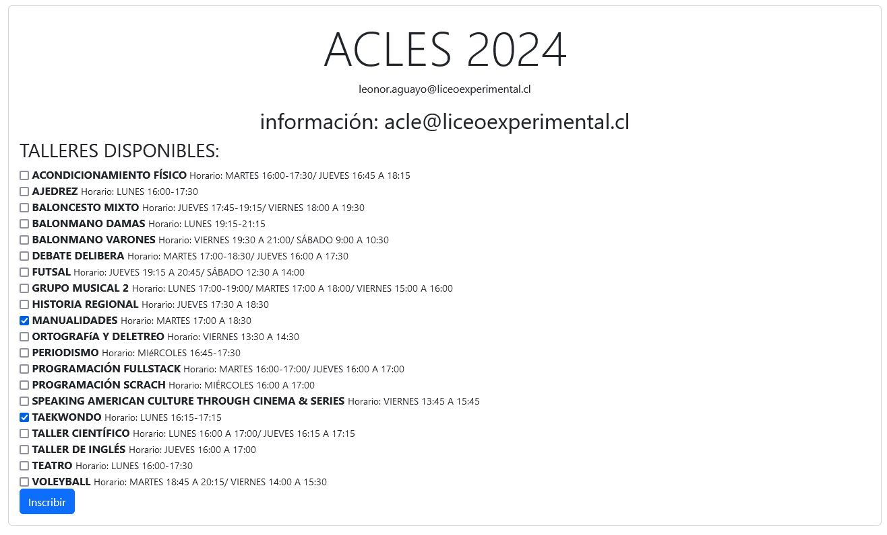
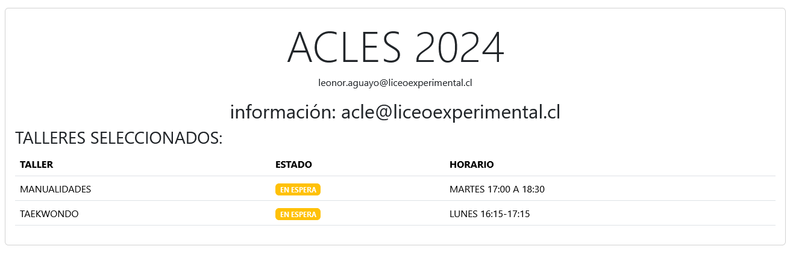

# ACLES
En esta sección, podrá inscribirse en los diversos talleres ACLES que ofrece el establecimiento, de acuerdo con el calendario de postulaciones. También podrá visualizar los talleres en los que ya está inscrito.

### Visualización de talleres inscritos

### Inscripción
Para inscribirse en un taller, de acuerdo con el calendario de postulaciones, debe seleccionar los talleres (máximo 2) y hacer clic en el botón Inscribir. Esta acción dejará su estado en 'en espera', quedando pendiente su estado.

### Video explicativo para inscribirse
https://youtu.be/aBLu66drrBY

<iframe width="560" height="315" src="https://www.youtube.com/embed/aBLu66drrBY?si=kLvAOMhhGRcFEpLh" title="YouTube video player" frameborder="0" allow="accelerometer; autoplay; clipboard-write; encrypted-media; gyroscope; picture-in-picture; web-share" referrerpolicy="strict-origin-when-cross-origin" allowfullscreen></iframe>

**Importante: Los talleres son mostrados según el nivel/curso en que se encuentra el estudiante.**